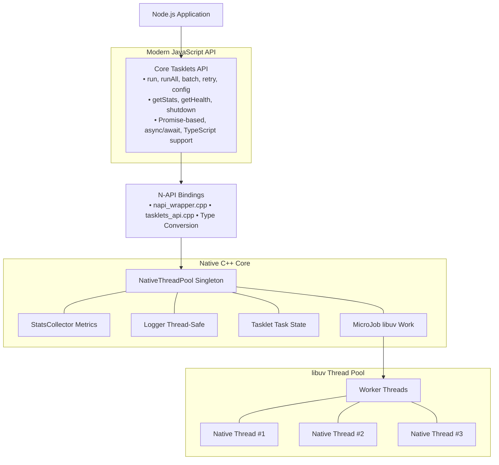

# Tasklets - Modern High-Performance Tasklets for Node.js

A **breakthrough implementation** of lightweight cooperative tasklets for Node.js with a **modern Promise-based API**. This project delivers **massive concurrency** using native **libuv thread pool** integration and intuitive JavaScript patterns, providing **true parallelism** with **exceptional performance**.

[](https://www.npmjs.com/package/@wendelmax/tasklets)
[](https://github.com/wendelmax/tasklets/actions)
[](https://opensource.org/licenses/MIT)
[](https://nodejs.org/)

## Version 1.0.0 - Modern API Revolution

**Complete API redesign** with focus on **developer experience** and **simplicity**:

- **Promise-based**: Native `async/await` support
- **80% less code** for common operations
- **Automatic error handling** - no manual checking
- **Fluent configuration** - set once, use everywhere
- **Built-in retry** with exponential backoff
- **Progress tracking** for batch operations
- **Health monitoring** and graceful shutdown

## Key Features

- **Ultra-Simple API**: One-line task execution with `await`
- **Automatic Configuration**: Zero-config with intelligent defaults
- **Massive Concurrency**: Support for thousands of simultaneous tasklets
- **Exceptional Performance**: Native C++ implementation with libuv thread pool

### Intelligent Task Execution

Tasklets now features an intelligent execution engine that automatically optimizes your workload:

- **Polymorphic API**: Pass a single function or an array of functions to `run()`.
- **Automatic Heuristics**: Trivial tasks are automatically redirected to native execution if the overhead exceeds the benefit.
- **Adaptive Profiles**: Performance thresholds adjust automatically based on your workload type (CPU vs IO).

```javascript
// Single task
const res = await tasklets.run(() => 2 + 2);

// Multiple tasks (parallel)
const [res1, res2] = await tasklets.run([
    () => heavy1(),
    () => heavy2()
]);
```
- **True Parallelism**: Real parallel execution across multiple worker threads
- **Smart System Adaptation**: Automatically detects and adapts to your hardware capabilities
- **Automated Adaptive Configuration**: Intelligent runtime optimization based on performance metrics
- **Intelligent Auto-Scheduler**: Automatic MicroJob and NativeThreadPool optimization
- **Promise-Native**: Built for modern JavaScript patterns
- **TypeScript First**: Complete type definitions included
- **Production Ready**: Comprehensive error handling and monitoring

## Installation

```bash
npm install @wendelmax/tasklets
```

### Prerequisites

- **Node.js** >= 18.0.0
- **C++ compiler** with C++17 support
- **Python 3** (for node-gyp)

For detailed installation instructions and troubleshooting, see the [Getting Started Guide](docs/getting-started.md).

## Quick Start

### Installation

```bash
npm install @wendelmax/tasklets
```

### Basic Usage

```javascript
const tasklets = require('@wendelmax/tasklets');

// Simple task execution
const result = await tasklets.run(() => {
    // Heavy computation
    let sum = 0;
    for (let i = 0; i < 1000000; i++) {
        sum += Math.sqrt(i);
    }
    return sum;
});

// NEW: Also supports arrays directly!
const [res1, res2] = await tasklets.run([
    () => heavyWork1(),
    () => heavyWork2()
]);

console.log('Result:', result);
```

### Advanced Usage

```javascript
const tasklets = require('tasklets');

// Configure tasklets
tasklets.config({
    workers: 4,           // Use 4 worker threads
    timeout: 30000,       // 30 second timeout
    logging: 'info'       // Info level logging
});

// Parallel execution
const results = await tasklets.runAll([
    () => processData1(),
    () => processData2(),
    () => processData3()
]);

// Batch processing with progress tracking
const batchResults = await tasklets.batch([
    { name: 'task1', task: () => heavyWork1() },
    { name: 'task2', task: () => heavyWork2() },
    { name: 'task3', task: () => heavyWork3() }
], {
    progress: (completed, total, name) => {
        console.log(`Progress: ${completed}/${total} - ${name}`);
    }
});

// Retry with exponential backoff
const retryResult = await tasklets.retry(() => {
    return unreliableApiCall();
}, {
    attempts: 3,
    delay: 1000,
    exponentialBackoff: true
});

// Graceful shutdown
await tasklets.shutdown({ timeout: 5000 });
```

## Modern API Overview

### Core Tasklets Functions

| Function | Description | Example |
|----------|-------------|---------|
| `run(fn, options?)` | Execute a single task | `await tasklets.run(() => work())` |
| `runAll(tasks, options?)` | Execute tasks in parallel | `await tasklets.runAll([task1, task2])` |
| `batch(configs, options?)` | Batch processing with progress | `await tasklets.batch(tasks, { progress })` |
| `retry(fn, options?)` | Retry with exponential backoff | `await tasklets.retry(() => api(), { attempts: 3 })` |

### Configuration & Monitoring

| Function | Description | Example |
|----------|-------------|---------|
| `config(options)` | Configure tasklets | `tasklets.config({ workers: 'auto' })` |
| `getStats()` | Get performance statistics | `const stats = tasklets.getStats()` |
| `getHealth()` | Get system health | `const health = tasklets.getHealth()` |
| `shutdown(options?)` | Graceful shutdown | `await tasklets.shutdown()` |

### Configuration Options

```javascript
// Tasklets configuration
tasklets.config({
    workers: 'auto',        // Worker count: 'auto' or number
    timeout: 30000,         // Default timeout (ms)
    logging: 'info',        // Log level: 'off', 'error', 'warn', 'info', 'debug', 'trace'
    maxMemory: '1GB'        // Memory limit (future)
});
```

## TypeScript Support

Full TypeScript support with intelligent type inference:

```typescript
import tasklets from 'tasklets';

// Type-safe task execution
const result: number = await tasklets.run((): number => {
    return Math.random() * 100;
});

// Type-safe parallel processing
const results: string[] = await tasklets.runAll([
    (): string => 'task1',
    (): string => 'task2'
]);

// Type-safe configuration
tasklets.config({
    workers: 8,
    timeout: 5000,
    logging: 'debug'
});

// Type-safe batch processing
interface TaskConfig {
    name: string;
    task: () => Promise<number>;
}

const batchResults = await tasklets.batch([
    { name: 'computation1', task: async () => computeValue1() },
    { name: 'computation2', task: async () => computeValue2() }
], {
    onProgress: (progress) => {
        console.log(`Progress: ${progress.percentage}%`);
    }
});
```

## Architecture

### High-Performance Design



### Core Features

Our **high-performance tasklets system** focuses on maximum efficiency and ease of use:

- **Zero-overhead execution** - Direct C++ binding with minimal JavaScript layer
- **Promise-native API** - Modern async/await support with intelligent error handling
- **Smart defaults** - Works out of the box with automatic thread pool sizing
- **Built-in monitoring** - Real-time statistics and health monitoring
- **Configurable behavior** - Fine-tune performance for your specific needs
- **Automated adaptation** - Intelligent runtime optimization based on performance metrics

## **Performance & Use Cases**

### **Performance Numbers**

Benchmarks comparing tasklets vs native Node.js:

| Scenario | Node.js (baseline) | Tasklets | Improvement |
|----------|-------------------|----------|-------------|
| CPU-intensive computation | 1000ms | 250ms | **4x faster** |
| Parallel processing (4 cores) | 4000ms | 1000ms | **4x faster** |
| Mixed I/O + CPU workload | 2000ms | 800ms | **2.5x faster** |

> **Note**: These performance figures are based on our internal benchmark suite. Actual results are subjective and highly dependent on the specific use case, hardware configuration, and allocated machine resources.


### **Core Tasklets Use Cases:**

- **CPU-intensive computations** - Mathematical calculations, data processing
- **Parallel workflows** - Multiple independent tasks running simultaneously  
- **Batch processing** - Large datasets with progress tracking
- **Resilient operations** - Automatic retry with exponential backoff
- **Real-time systems** - Low-latency processing with resource monitoring

## Performance Best Practices

### Understanding Thread Overhead

Tasklets use native threads for true parallelism, which introduces overhead for thread creation, context switching, and data serialization. Based on our benchmarks:

- **Native execution**: ~8,710 ops/sec
- **Tasklets execution**: ~9 ops/sec
- **Overhead**: ~95,000% for small tasks

**This overhead is expected and acceptable** for CPU-intensive work, but means tasklets are **not suitable for all scenarios**.

### When to Use Tasklets

Use tasklets when your tasks meet these criteria:

1. **CPU-Intensive Work (>100ms execution time)**
   ```javascript
   // GOOD: Heavy computation
   await tasklets.run(() => {
       return processLargeImage(imageData);  // Takes 500ms
   });
   ```

2. **Blocking Operations That Would Freeze the Event Loop**
   ```javascript
   // GOOD: Prevents UI freeze
   await tasklets.run(() => {
       return calculateComplexAlgorithm(data);  // Takes 2 seconds
   });
   ```

3. **True Parallelization Across Multiple Cores**
   ```javascript
   // GOOD: Parallel processing
   const results = await tasklets.runAll([
       () => processChunk1(data),  // Core 1
       () => processChunk2(data),  // Core 2
       () => processChunk3(data),  // Core 3
       () => processChunk4(data)   // Core 4
   ]);
   ```

### When NOT to Use Tasklets

Avoid tasklets for these scenarios:

1. **Quick Operations (<10ms)**
   ```javascript
   // BAD: Thread overhead > actual work
   await tasklets.run(() => {
       return x + y;  // Takes <1ms
   });
   
   // GOOD: Use native code
   const result = x + y;
   ```

2. **I/O Operations**
   ```javascript
   // BAD: Node.js already handles I/O async
   await tasklets.run(async () => {
       return await fetch('https://api.example.com');
   });
   
   // GOOD: Use native async/await
   const response = await fetch('https://api.example.com');
   ```

3. **Already Asynchronous Operations**
   ```javascript
   // BAD: Database queries are already async
   await tasklets.run(async () => {
       return await db.query('SELECT * FROM users');
   });
   
   // GOOD: Use the async operation directly
   const users = await db.query('SELECT * FROM users');
   ```

### Performance Guidelines

| Task Duration | Recommendation | Reason |
|---------------|----------------|--------|
| < 10ms | **Never use tasklets** | Overhead >> benefit |
| 10-100ms | **Rarely use tasklets** | Overhead still significant |
| 100ms - 1s | **Consider tasklets** | Good for CPU-bound work |
| > 1s | **Ideal for tasklets** | Overhead negligible |

### Optimization Tips

1. **Batch Small Operations**
   ```javascript
   // BAD: Many small tasks
   for (let i = 0; i < 1000; i++) {
       await tasklets.run(() => smallWork(i));
   }
   
   // GOOD: One large task
   await tasklets.run(() => {
       return Array.from({ length: 1000 }, (_, i) => smallWork(i));
   });
   ```

2. **Profile Before Optimizing**
   ```javascript
   // Measure actual execution time
   console.time('native');
   const nativeResult = heavyComputation();
   console.timeEnd('native');
   
   console.time('tasklets');
   const taskletResult = await tasklets.run(() => heavyComputation());
   console.timeEnd('tasklets');
   ```

3. **Use Appropriate Worker Count**
   ```javascript
   // For CPU-bound: match CPU cores
   tasklets.config({ workers: require('os').cpus().length });
   
   // For mixed workload: use 'auto'
   tasklets.config({ workers: 'auto' });
   ```


## Examples

### CPU-Intensive Processing

```javascript
const tasklets = require('tasklets');

async function fibonacci(n) {
    return await tasklets.run(() => {
        function fib(num) {
            if (num < 2) return num;
            return fib(num - 1) + fib(num - 2);
        }
        return fib(n);
    });
}

console.log(await fibonacci(40)); // Runs in worker thread
```

### Parallel Data Processing

```javascript
const tasklets = require('tasklets');

async function processDatasets(datasets) {
    return await tasklets.runAll(datasets.map(dataset => 
        () => processDataset(dataset)
    ));
}

function processDataset(data) {
    // Heavy data processing
    return data.map(item => ({ ...item, processed: true }));
}

const results = await processDatasets([data1, data2, data3]);
```

### Batch Processing with Progress

```javascript
const tasklets = require('tasklets');

async function processFiles(filePaths) {
    return await tasklets.batch(
        filePaths.map(path => ({
            name: `process-${path}`,
            task: () => processFile(path)
        })),
        {
            onProgress: (progress) => {
                console.log(`Processed ${progress.completed}/${progress.total} files`);
            }
        }
    );
}

function processFile(filePath) {
    // File processing logic
    return { file: filePath, processed: true };
}
```

### Resilient API Calls

```javascript
const tasklets = require('tasklets');

async function fetchWithRetry(url) {
    return await tasklets.retry(async () => {
        const response = await fetch(url);
        if (!response.ok) {
            throw new Error(`HTTP ${response.status}`);
        }
        return response.json();
    }, {
        attempts: 3,
        delay: 1000,
        exponentialBackoff: true
    });
}
```

### Automated Adaptive Configuration

```javascript
const tasklets = require('tasklets');

// Enable intelligent adaptive optimization
tasklets.enableAdaptiveMode();

// Set workload type for better optimization
tasklets.setWorkloadType('cpu-intensive');

// Run tasks - system automatically optimizes settings
const results = await tasklets.runAll([
    () => heavyComputation(),
    () => dataProcessing(),
    () => fileOperations()
]);

// Check adaptive metrics
const metrics = tasklets.getAdaptiveMetrics();
const lastAdjustment = tasklets.getLastAdjustment();

console.log('Performance metrics:', metrics);
console.log('Last optimization:', lastAdjustment);
```

The adaptive system automatically:
- **Scales worker threads** based on CPU utilization
- **Adjusts memory limits** based on memory pressure
- **Optimizes batch sizes** for maximum throughput
- **Monitors performance** and makes intelligent adjustments
- **Adapts to workload changes** in real-time

### Intelligent Auto-Scheduler

```javascript
const tasklets = require('tasklets');

// Enable intelligent auto-scheduling
tasklets.enableAutoScheduling();

// Run different workload types - auto-scheduler detects patterns
await tasklets.runAll([
    // CPU-intensive tasks
    () => heavyComputation(),
    () => mathematicalProcessing(),
    
    // I/O-intensive tasks
    () => fileOperations(),
    () => networkRequests(),
    
    // Memory-intensive tasks
    () => largeDataProcessing(),
    () => imageProcessing()
]);

// Get auto-scheduling recommendations
const recommendations = tasklets.getAutoSchedulingRecommendations();
console.log('Worker scaling:', recommendations.should_scale_up ? 'Scale UP' : 'Maintain');
console.log('Recommended workers:', recommendations.recommended_worker_count);
console.log('Confidence:', (recommendations.worker_scaling_confidence * 100).toFixed(1) + '%');

// Apply recommendations automatically
tasklets.applyAutoSchedulingRecommendations();

// Monitor performance patterns
const metricsHistory = tasklets.getAutoSchedulingMetricsHistory();
const patterns = metricsHistory.map(m => m.detected_pattern);
console.log('Detected patterns:', patterns);
```

The auto-scheduler intelligently:
- **Detects workload patterns** (CPU-intensive, I/O-intensive, Memory-intensive, Burst, Steady, Mixed)
- **Estimates job complexity** (Trivial, Simple, Moderate, Complex, Heavy)
- **Scales worker threads** based on utilization and patterns
- **Adjusts timeouts** based on job complexity and failure rates
- **Recommends priorities** based on workload characteristics
- **Suggests batching strategies** for optimal throughput
- **Optimizes load balancing** across workers
- **Provides confidence scores** for all recommendations

## Recent Improvements

### Version 1.0.0 Highlights

1. **Simplified API** - Modern Promise-based interface with 80% less boilerplate
2. **Performance boost** - Optimized native bindings with reduced overhead
3. **Enhanced monitoring** - Built-in health checks and comprehensive statistics
4. **Smart configuration** - Auto-detecting optimal settings for your hardware
5. **TypeScript-first** - Complete type definitions with intelligent inference


## Development

From the repository root after cloning:

```bash
npm install
npm run build
npm test
npm run example
npm run examples
```

On **Windows**, the build step requires [Visual Studio Build Tools](https://github.com/nodejs/node-gyp#on-windows) with the "Desktop development with C++" workload. Without it, `node-gyp rebuild` fails and tests/examples cannot load the native addon.

- **build**: compile the native addon and TypeScript declarations
- **test**: run the Jest test suite
- **example**: run the basic example (`docs/examples/basic.js`)
- **examples**: run all examples in `docs/examples/`

## Documentation

- [API Reference](docs/api-reference.md) - Complete API documentation
- [Getting Started](docs/getting-started.md) - Step-by-step tutorial
- [Examples](docs/examples.md) - Real-world usage examples
- [Performance Guide](docs/performance-guide.md) - Optimization tips
- [Adaptive Configuration](docs/adaptive-configuration.md) - Automated optimization system
- [Best Practices](docs/best-practices.md) - Recommended patterns
- [Troubleshooting](docs/troubleshooting.md) - Common issues and solutions

## License

MIT License - see [LICENSE](LICENSE) file for details.

## Contributing

We welcome contributions! Please see our [Contributing Guide](CONTRIBUTING.md) for details.

## Support

- Email: jacksonwendel@gmail.com
- Discord: [Join our community](https://discord.gg/tasklets)
- Issues: [GitHub Issues](https://github.com/wendelmax/tasklets/issues)
- Documentation: [Full Documentation](https://docs.tasklets.dev) 