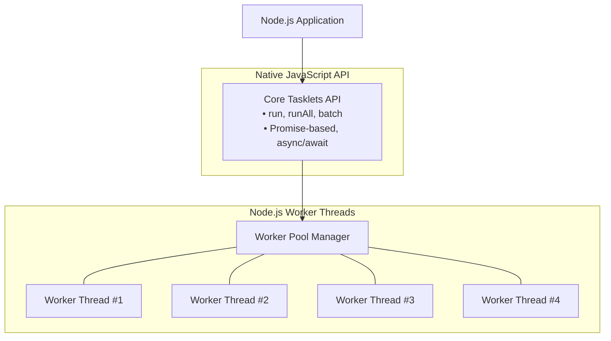

# Tasklets - Modern High-Performance Tasklets for Node.js

A **breakthrough implementation** of lightweight cooperative tasklets for Node.js with a **modern Promise-based API**. This project delivers **massive concurrency** using native **Node.js Worker Threads** and intuitive JavaScript patterns, providing **true parallelism** with **exceptional performance**.

[](https://www.npmjs.com/package/@wendelmax/tasklets)
[](https://opensource.org/licenses/MIT)
[](https://nodejs.org/)

## Version 2.0.0 - Native Revolution

**Complete native rewrite** with focus on **compatibility** and **simplicity**:

- **Zero Dependencies**: 100% Native JavaScript (ES2020)
- **Cross-Platform**: Works anywhere Node.js runs (Windows, Linux, macOS)
- **No Compilation**: No `node-gyp`, Python, or Visual Studio required
- **Promise-based**: Native `async/await` support
- **True Parallelism**: Uses `worker_threads` for non-blocking execution

## Key Features

- **Ultra-Simple API**: One-line task execution with `await`
- **Automatic Configuration**: Zero-config with intelligent defaults
- **Massive Concurrency**: Support for thousands of simultaneous tasklets
- **Thread Safety**: Isolated contexts avoid common threading issues

### Intelligent Task Execution

Tasklets features an intelligent execution engine that automatically optimizes your workload:

- **Polymorphic API**: Pass a single function or an array of functions to `run()`.
- **Argument Passing**: Safely pass data to workers without closure issues.

```javascript
// Single task
const res = await tasklets.run(() => 2 + 2);

// Task with arguments (Safe way to pass data)
const data = { value: 42 };
const res = await tasklets.run((input) => {
    return input.value * 2;
}, data);

// Multiple tasks (parallel)
const [res1, res2] = await tasklets.runAll([
    () => heavy1(),
    () => heavy2()
]);
```

## Installation

```bash
npm install @wendelmax/tasklets
```

### Prerequisites

- **Node.js** >= 14.0.0

That's it! No compilers, no Python, no build tools.

## Quick Start

### Basic Usage

```javascript
const tasklets = require('@wendelmax/tasklets');

// Simple task execution
const result = await tasklets.run(() => {
    // Heavy computation
    let sum = 0;
    for (let i = 0; i < 1000000; i++) {
        sum += Math.sqrt(i);
    }
    return sum;
});

// Parallel execution
const [res1, res2] = await tasklets.runAll([
    () => heavyWork1(),
    () => heavyWork2()
]);

console.log('Result:', result);
```

### Advanced Usage

```javascript
const tasklets = require('@wendelmax/tasklets');

// Configure tasklets with Dynamic Scaling
// The pool automatically scales up to 'maxWorkers' under load
// and scales down to 'minWorkers' when idle.
tasklets.configure({
    minWorkers: 2,      // Keep 2 workers warm (default: 1)
    maxWorkers: 16,     // Cap at 16 workers (default: CPU cores)
    idleTimeout: 10000  // Terminate idle workers after 10s (default: 5000ms)
});

// Parallel execution
const results = await tasklets.runAll([
    () => processData1(),
    () => processData2(),
    () => processData3()
]);

// Batch processing
const batchResults = await tasklets.batch([
    { name: 'task1', task: () => heavyWork1() },
    { name: 'task2', task: (val) => heavyWork2(val), args: [123] }
]);
```

## Observability

Monitor your application's health and performance in real-time:

### System Statistics

```javascript
const stats = tasklets.getStats();
console.log(stats);
// Output:
// {
//   activeTasks: 2,           // Tasks currently in progress
//   totalWorkers: 8,          // Total worker threads in pool
//   activeWorkers: 2,         // Workers currently busy
//   idleWorkers: 6,           // Workers waiting for tasks
//   queuedTasks: 0,           // Tasks waiting in the queue
//   throughput: 154.2,        // Tasks completed per second
//   avgTaskTime: 45.2,        // Average execution time in ms
//   config: { ... }           // Current pool configuration
// }
```

### Health Monitoring

```javascript
const health = tasklets.getHealth();
console.log(health);
// Output:
// {
//   status: 'healthy',        // Overall system status
//   workers: 8,               // Current worker count
//   memoryUsagePercent: 42.5  // System memory usage
// }
```

## Architecture

### Native Worker Design



### Why Native?

- **Stability**: No more "Module did not self-register" or ABI mismatch errors.
- **Portability**: Code runs identically on local dev, CI runners, and production servers.
- **Performance**: While C++ threads are lighter, Node.js Workers provide better isolation and safety for JavaScript execution.

## Performance Best Practices

### Passing Data

Workers run in isolated contexts. Does not share memory (heap) with the main thread.
**Always use arguments** to pass data instead of relying on closures.

```javascript
// BAD - Variable 'externalData' is not available in worker scope
const externalData = 100;
await tasklets.run(() => {
    return 5 + externalData; // Crash! 'externalData' is undefined
});

// GOOD - Pass as argument
const externalData = 100;
await tasklets.run((val) => {
    return 5 + val;
}, externalData);
```

### When to Use Tasklets

1. **CPU-Intensive Work (>10ms execution time)**
   Encryption, image processing, complex calculations.

2. **Blocking Operations**
   JSON parsing large files, synchronous compression.

3. **True Parallelization**
   Running multiple independent tasks simultaneously.

## License

MIT License - see [LICENSE](LICENSE) file for details.

## Support

- Email: jacksonwendel @ gmail.com
- Issues: [GitHub Issues](https://github.com/wendelmax/tasklets/issues)