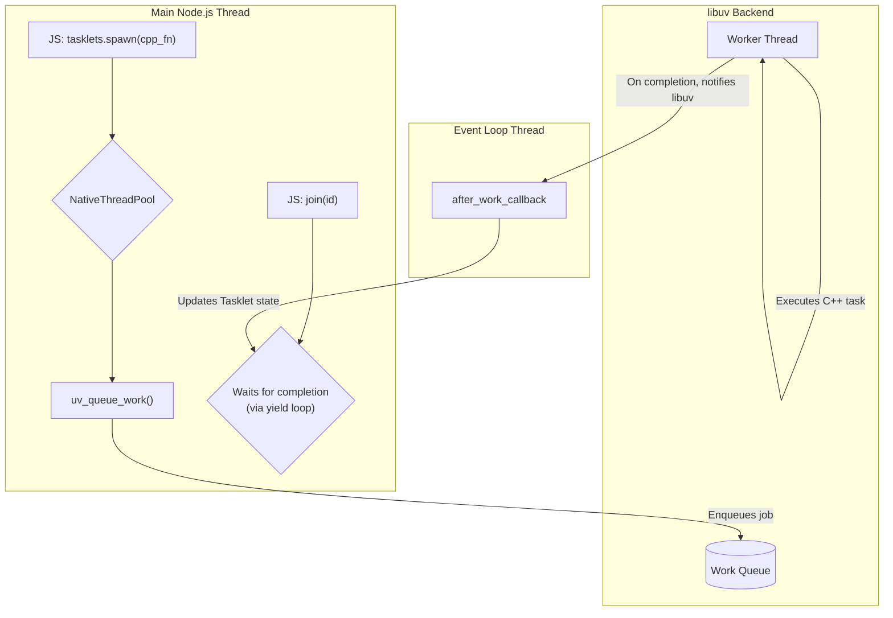
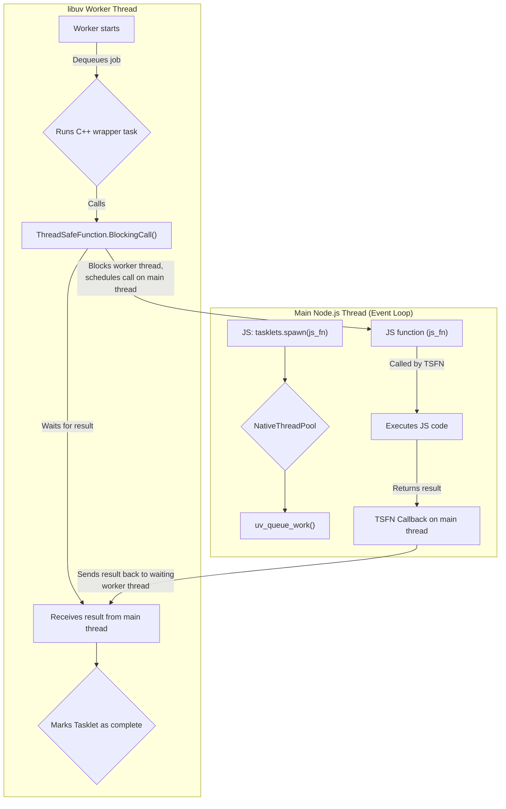
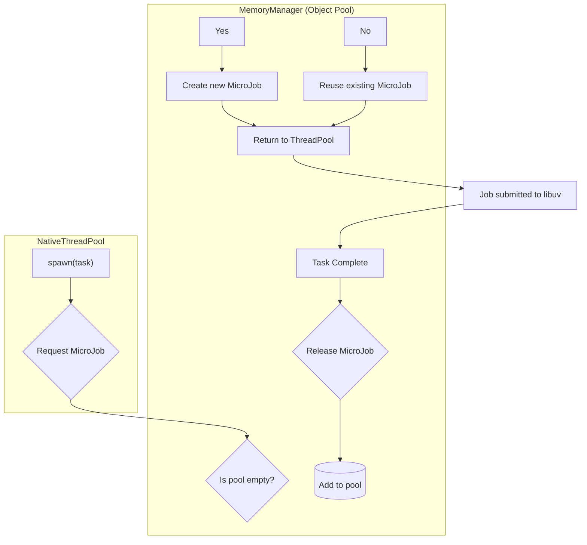
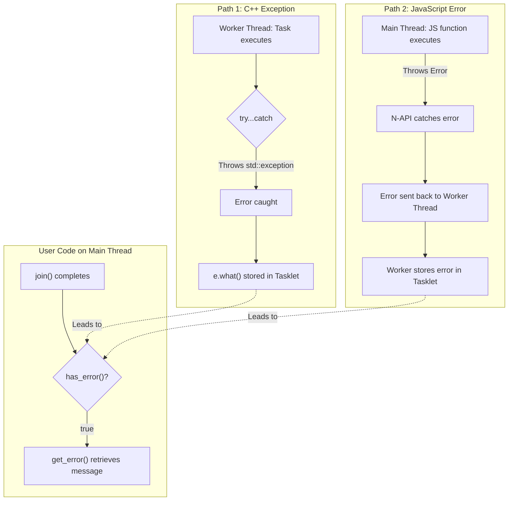

# Tasklets Threading Model Deep Dive

This document provides a detailed analysis of the threading model used by the `tasklets` library. Understanding this model is key to writing efficient, scalable, and safe code. Our goal is to leverage the power of multi-core systems without exposing the user to the complexities of direct thread management.

We achieve this by integrating with `libuv`, the same asynchronous I/O library that powers Node.js itself.

---

## Core Philosophy

The core philosophy is to **delegate, not reinvent**. Instead of building a thread pool from scratch, `tasklets` delegates all thread management and task scheduling to `libuv`'s battle-tested work queue. This ensures stability, performance, and seamless integration with the Node.js event loop.

---

## Key Components

Our threading architecture is composed of a few key C++ classes:

-  **`Tasklet`**: A lightweight object that represents a single unit of work. It encapsulates the user's function and tracks the task's state (e.g., pending, running, finished, errored). A `Tasklet` is a concept, **not** an OS thread.

-  **`NativeThreadPool`**: The central coordinator. This singleton class is the main entry point for the system. It's responsible for:
  -  Creating and managing `Tasklet`s.
  -  Submitting tasks to the `libuv` thread pool.
  -  Handling communication between the main Node.js thread and the worker threads.

-  **`MicroJob`**: A small wrapper struct that contains the `Tasklet` and other data needed for `libuv` to execute the work. We use an object pool to recycle `MicroJob` instances, minimizing memory allocation overhead.

-  **`libuv` Thread Pool**: The underlying engine. `libuv` maintains a pool of native OS-level worker threads. When we submit a `MicroJob`, `libuv` places it in a queue, and one of its worker threads will eventually pick it up and execute it.

---

## The Lifecycle of a Tasklet

Here is a step-by-step breakdown of what happens when you spawn a task, illustrated by a visual flow.

### Visualizing the Task Lifecycle

This diagram shows the journey of a standard C++ task from creation to completion.



---

### 1. Spawning a Task

It all starts when your JavaScript code calls `tasklets.spawn()`.

```javascript
const { tasklets } = require('tasklets');

const taskletId = tasklets.spawn(() => {
  // This is the function that will run on a worker thread.
  console.log('Hello from a worker thread!');
  return 42;
});
```

Inside the C++ addon, a `Tasklet` object is created to represent this work.

### 2. Execution in a Worker Thread

The `NativeThreadPool` wraps the `Tasklet` in a `MicroJob` and submits it to `libuv` by calling `uv_queue_work()`.

At this point, `libuv` takes over. It places the `MicroJob` in its internal work queue. As soon as a worker thread in the pool becomes available, it dequeues the job and executes the associated function.

This is where the actual multi-threading happens. The user's function runs on a separate thread, managed entirely by `libuv` and the operating system, leaving the Node.js event loop free to handle other requests.

### 3. JavaScript and C++ Interoperability

A significant feature of `tasklets` is the ability to execute JavaScript functions on worker threads. This is a complex operation because Node.js APIs (N-API) are generally not thread-safe. To achieve this safely, we use a `Napi::ThreadSafeFunction` to bridge the gap between the worker threads and the main Node.js event loop.

The flow for a JavaScript task is more intricate, as it involves coordinating between a worker thread and the main event loop.

#### Visualizing the JavaScript Task Flow



#### The JS Interop Steps

When you spawn a JS function:

1.  A C++ lambda is submitted to the `libuv` pool. This C++ code acts as a wrapper.
2.  From the worker thread, this wrapper uses a `ThreadSafeFunction` to schedule the *execution* of your JavaScript function back on the **main Node.js event loop thread**.
3.  The worker thread **blocks** and waits for the JavaScript function to complete.
4.  Once the JS function finishes on the main thread, its result is communicated back to the waiting worker thread via a callback.
5.  The worker thread unblocks, receives the result, and marks the `Tasklet` as complete.

This model ensures that all JavaScript code runs in its proper context (the event loop), preventing crashes and race conditions, while still allowing the heavy C++ parts of a task (if any) to run in the background.

### 4. Returning Results and Handling Errors

When a task function (either C++ or JS) finishes, its return value or any exception thrown is captured within the `Tasklet` object.

The `NativeThreadPool` uses a callback (`after_work_callback`) that `libuv` guarantees will run on the main event loop thread. In this callback, we can safely update statistics and prepare the `Tasklet` for cleanup. The result or error is stored, ready for you to retrieve it with `getResult()` or `getError()`.

---

## Task Scheduling and Synchronization

### Scheduling and Prioritization

The scheduling strategy in `tasklets` is straightforward and determined by `libuv`. When tasks are submitted, they are placed into a **First-In, First-Out (FIFO)** queue. The `libuv` worker threads consume tasks from this queue as they become available.

**There is currently no mechanism for task prioritization.** All tasklets are treated with equal priority. If a high-priority task is submitted after several long-running low-priority tasks, it will have to wait for the preceding tasks to be processed first. For future development, a priority queue system could be considered if required by the community.

### Synchronization Mechanisms

Synchronizing the state between the main Node.js thread and the multiple worker threads is critical for correctness. `tasklets` employs two primary synchronization mechanisms.

#### 1. `join()` for Task Completion

If your main thread needs to wait for a specific task to complete, you can use `join(taskletId)`. The `join` implementation performs a **busy-wait loop** that continuously checks the tasklet's `is_finished()` status.

Inside the loop, it calls `std::this_thread::yield()`. This is a crucial optimization that hints to the operating system's scheduler that the current thread can be temporarily paused to allow other threads to run. This prevents the main thread from consuming 100% CPU while waiting, making it much more efficient than a simple empty loop. A timeout is also included to prevent indefinite blocking in case of a deadlock.

#### 2. `ThreadSafeFunction` for JS Interop

As detailed in the interoperability section, `Napi::ThreadSafeFunction` is the primary mechanism for safely communicating between worker threads and the Node.js event loop. It acts as a thread-safe channel to invoke JavaScript code from any other thread, handling all the necessary locking and event queuing internally.

---

## Advanced Topics and Best Practices

To help you get the most out of `tasklets`, this section covers memory management, error handling, and common design patterns.

### Memory Management and Performance

Performance is a key goal of `tasklets`. We've built in several optimizations to minimize overhead and prevent common sources of memory leaks.

*  **`MicroJob` Object Pooling**: To avoid the performance cost of frequent memory allocations, `tasklets` uses an object pool for `MicroJob` wrappers. Instead of creating a new `MicroJob` for every task and deleting it afterward, we recycle existing instances. This significantly reduces the overhead of spawning tasks. The process is visualized below.



*  **`Tasklet` Lifecycle Management**: The lifecycle of `Tasklet` objects is managed automatically using C++ smart pointers (`std::shared_ptr`). This modern memory management technique ensures that a `Tasklet` is deallocated if and only if it is no longer being used by the thread pool or referenced anywhere in your code. This helps prevent memory leaks.

*  **Data Transfer Costs**: While it's powerful to move work between threads, there is always a cost associated with transferring data. This is especially true for JavaScript tasks that involve complex objects. Be mindful that large data payloads must be serialized and deserialized, which can impact performance. For best results, keep the data passed between the main thread and worker threads as minimal as possible.

### Advanced Error Handling

Robust error handling is critical in a multi-threaded environment. `tasklets` ensures that errors are captured correctly, regardless of where they occur. The following diagram illustrates how errors from both C++ and JavaScript are channeled into the `Tasklet` object, which can then be safely queried from your code.



*  **C++ Exceptions**: If a C++ function executed by a tasklet throws an `std::exception`, our system automatically catches it within the worker thread. The exception's message (`e.what()`) is extracted and stored safely within the corresponding `Tasklet` object.

*  **JavaScript Errors**: Similarly, if a JavaScript function executed via `tasklets` throws an error, the `ThreadSafeFunction` mechanism catches the exception on the main event loop. This error is then securely communicated back to the waiting worker thread and stored in the `Tasklet`.

*  **Retrieving Errors**: From your main JavaScript thread, you can confidently check for and handle these errors. A task that has thrown an exception will be marked as `finished` and will have its error flag set.

Here is the standard pattern for retrieving results or errors:

```javascript
const taskletId = tasklets.spawn(() => {
  // This might throw an error
  throw new Error("Something went wrong inside the tasklet!");
});

// Wait for the task to finish
tasklets.join(taskletId);

// Check if an error occurred
if (tasklets.has_error(taskletId)) {
  const errorMessage = tasklets.get_error(taskletId);
  console.error(`Tasklet [${taskletId}] failed: ${errorMessage}`);
} else {
  const result = tasklets.get_result(taskletId);
  console.log(`Tasklet [${taskletId}] succeeded with result: ${result}`);
}
```

### Best Practices and Common Pitfalls

*  **Task Granularity**: Think carefully about the size of your tasks.
  *  **Tasks that are too small** can be inefficient. The overhead of scheduling the task might be greater than the work it performs.
  *  **Tasks that are too large** can monopolize a worker thread, delaying the execution of other pending tasks.
  *  **Guideline**: Aim for medium-grained, CPU-bound tasks. If you have a very large problem, try to break it down into several independent tasklets.

*  **CPU-bound vs. I/O-bound Work**: `tasklets` is primarily designed to offload **CPU-bound** work (e.g., complex calculations, image processing, data analysis) from the Node.js event loop. For **I/O-bound** work (e.g., reading files, making network requests), Node.js's built-in asynchronous methods are already highly efficient and non-blocking. Using `tasklets` for I/O is possible, but it may not be the most effective pattern.

*  **Avoiding Deadlocks**: Be careful when using `join()`, especially with JavaScript tasklets. A deadlock can occur if the main thread `join()`s a tasklet that, in turn, requires some action from the blocked main thread to complete. This creates a circular dependency where nothing can proceed. Ensure your tasklets have minimal dependencies on the main thread while they are running.

## A Note on Context Switching

The term "context switching" is important here.

-  **Task Switching (in `libuv`)**: When a worker thread finishes one `MicroJob`, it immediately checks the queue for another. This is a simple, efficient process managed within the thread pool and does not involve the OS scheduler.

-  **Thread Context Switching (in the OS)**: The `libuv` worker threads are real OS threads. The operating system's scheduler is responsible for pausing and resuming these threads to share CPU time with all other processes on the system. This is a "heavy" operation where the CPU's state is saved and restored.

`tasklets` does not perform thread context switching itself. It relies on `libuv` for task scheduling and the OS for thread scheduling. This is the right way to build high-performance systems.

---

## Conclusion
The `tasklets` threading model is designed for performance, safety, and simplicity. By building on top of `libuv`, providing safe patterns for C++/JavaScript interaction, and encouraging best practices, we offer a powerful tool for offloading heavy computations from the Node.js event loop, enabling you to build more responsive and scalable applications. 